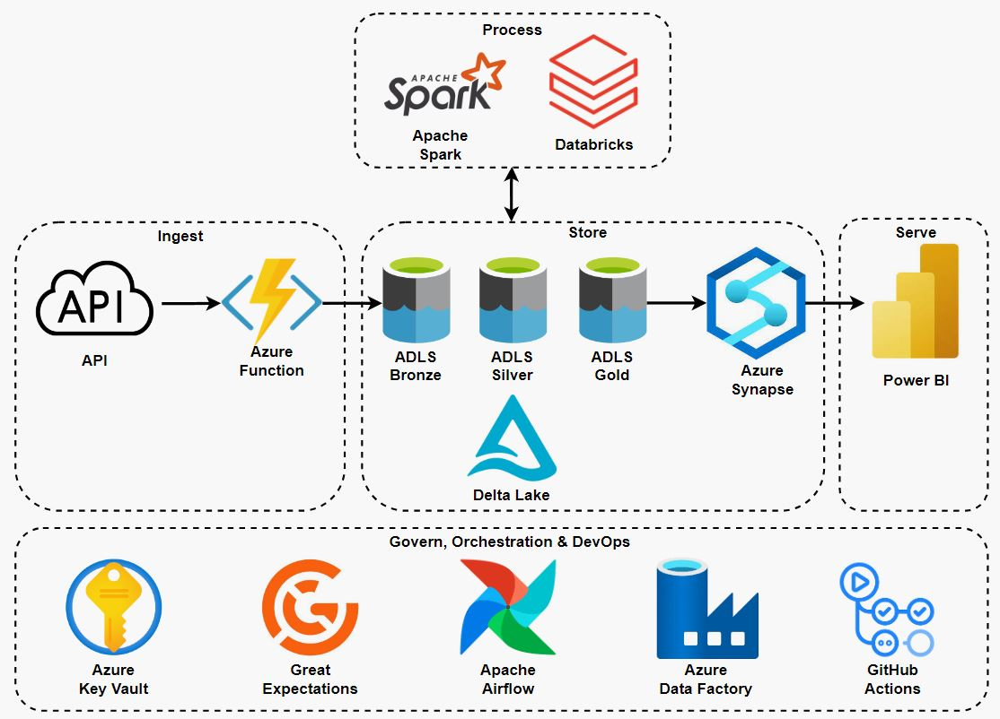
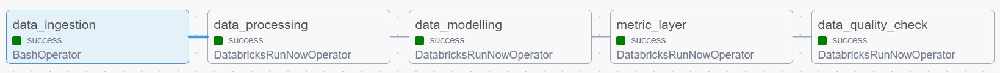
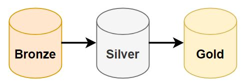
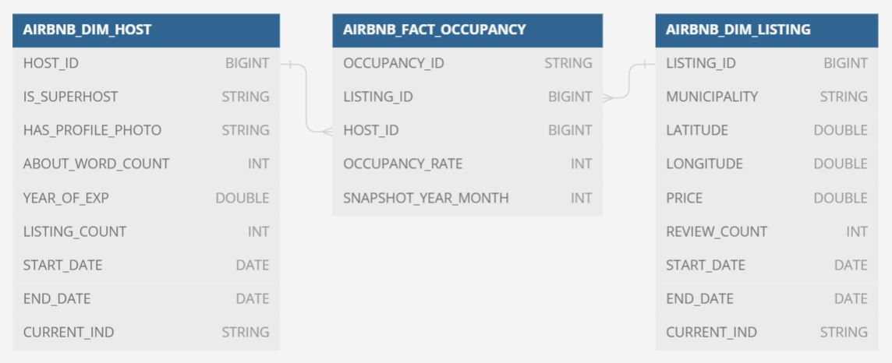
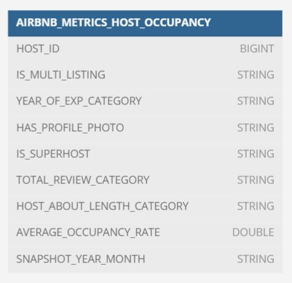
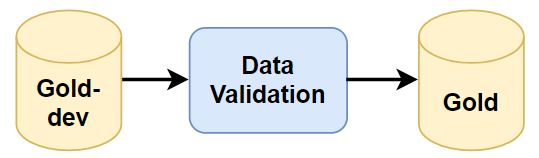
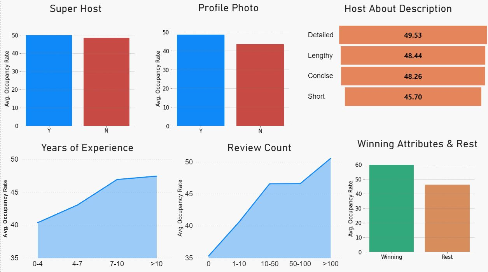

# Airbnb Host Analytics
This project analyses the impact of Airbnb host characteristics on property listing performance, specifically occupancy rates over the next 30 days. A robust data solution encompassing data collection, processing, and analysis has been designed and implemented to facilitate this study.

## Scope
- <b>Time Frame</b>:  
March 2023 to June 2023, focusing on Melbourne Airbnb listings.
- <b>Inclusion Criteria</b>:  
    - Verified host identities.
    - Listings available for at least 60, 90, and 365 days in the future.
    - Listings located in metropolitan municipalities to reduce regional effects.
    - Entire home/apt listings only.
    - Prices within the median to upper limit (median + 1.5 x IQR) range to minimise price effects.

The project aims for a one-time analysis with aggregated metrics served in a metrics layer for seamless BI integration.

## Architecture

The solution leverages a mix of open source and cloud tools hosted on Azure cloud environment. The data originates from the API server undergoing ingestion, storage, processing and lastly serving for analytics. Below describes how each tool participates in this data landscape.

- <b>Azure Functions</b>:  
Azure function app fetches Airbnb listing data from the API server and loads raw datasets as Parquet files into the Bronze layer of data lakehouse hosted on the Azure Data Lake Storage Gen 2.
- <b>Azure Data Lake Storage (ADLS) & Delta Lake</b>:  
Azure Data Lake Storage and Delta Lake support the data lakehouse enabling affordable, scalable storage with ACID transactions.
- <b>Apache Spark & Databricks</b>:  
Apache Spark is the main data processing engine running on the Databricks cluster. It interacts with the datasets sitting in the data lakehouse to progressively develope datasets through Bronze, Silver, Gold layers of the medallion architecture.
- <b>Azure Synapse</b>:  
The Gold layer dataset is copied into Azure Synapse from the data lakehouse. Azure Synapse is a datawarehouse servicing analytics and providing connections to the business intelligence tools.  
Note that Databricks also provides analytics features with its SQL warehouse and Dashboards. However due to limited resources of the Azure free-tier account, Azure Synapse was implemented instead for the analytics workload.
- <b>Power BI</b>:  
Power BI serves to provide data visualisations using the metrics layer dataset.
- <b>Azure Key Vault</b>:  
Azure Key Vault is used to store credentials of the Azure storage account, allowing data processes to access datasets in the data lakehouse securely.
- <b>Great Expectations</b>:  
Great Expectations is used as a data qaulity framework ensuring resultant data assets to be validated and reliable in the Gold layer of the data lakehouse.
- <b>Apache Airflow & Azure Data Factory</b>:   
Apache Airflow orchestrates the data flow by triggering Azure function app and Spark jobs on Databricks. Airflow is hosted on Azure Data Factory as a managed service.
- <b>Terraform</b>:  
Terraform is used to manage Azure Data Lake Storage infrastructure.
- <b>GitHub Actions</b>:  
GitHub Actions hosts CI pipeline running unit tests and integration tests on the data processes.

## Data Pipeline

The data pipeline is consisted of the following 6 tasks.

- <b>data_ingestion</b>:  
This task triggers the Azure function app by making a HTTP request. The triggered function will then fetches Airbnb listing datasets and load as Parquet files into the Bronze layer of the data lakehouse.
- <b>data_processing</b>:  
A Spark job in Databricks is triggered to process and filter the raw datasets with the conditions listed in the [Scope](#Scope). The processed datasets are then loaded into the Silver layer as Delta Lake tables.
- <b>data_modelling</b>:  
This task executes a Spark job in Databricks to transform the processed datasets into dimensional model tables. The dimensional model is stored in the Gold-dev layer.
- <b>model_data_quality_check</b>:  
A Python job in Databricks is initiated to validate dimensional model's data quality in the Gold-dev layer. The datasets are validated against the test cases defined in the YAML files using Great Expectations. Once validated successfully, the datasets are loaded into the Gold layer for consumption.
- <b>metrics_layer</b>:  
This task triggers a Spark job in Databricks to build a metrics layer on top of the dimensional model. The metrics layer table is then loaded into the Gold-dev layer.
- <b>metrics_data_quality_check</b>:  
This task validates the metrics layer in the Gold-dev layer using a Python job in Databricks. Great Expectations is used to check the data quality using test cases defined in the YAML file. After a successful data quality check, the metrics layer dataset is loaded into the Gold layer for consumption.

In scheduling the above tasks in Airflow, job monitoring is aided with email alerts via SMTP by sending email alerts upon a success or failure of the job.

## Data Modelling
### Medallion architecture

The data lakehouse is supported by the medallion architecture consisted of three layers:
- Bronze layer acts as a landing layer containing raw datasets.
- Silver layer contains cleansed and processed datasets.
- Gold layer comprises of dimensional model and metrics layer.

These layers allow easier governance and management of data at different stages while showing how data transforms through multiple steps.

### Dimensional Model

The dimensional model in the Gold layer stores 2 dimension tables and 1 fact table.  
The dimension tables hold details about hosts and listings with history using SCD type 2. And the fact table shows occupancy rates of the listings with monthly snapshots.  
This dimensional model is built to provide efficient query performance in analysing a listing's occupancy rate with host characteristics.

### Metrics Layer

On top of the dimensional model, a metrics layer is built by aggregating the latest occupancy rates of the listings from hosts coupled with their characteristics. The metrics layer abstracts the underlying complexities of the dimensional model, and provides consistent key metrics to the users.

## Data Quality
The quality of the data assets is validated using "Write-Audit-Publish" framework, where data asset is written to the non-production environment, followed by an data quality audit. And upon successful validation, the data asset is published to the production environment.

To achieve this, both dimensional model and metrics layer datasets are firstly written to the Gold-dev layer. And Great Expectaions is used as a data validation framework to check their data quality against predefined test cases. And once validated, the datasets are pushed to the Gold layer.

In such way, only the validated datasets will be consumed by the end users, making them reliable data assets.

## DevOps
The following aspects of DevOps are implemented in this project:
- <b>Static Test</b>:  
Code linting is done as a static test triggered by a Git commit action to validate the code style, format and syntax using linter tools like Flake8 and Black.
- <b>CI</b>:  
CI pipeline is executed on the GitHub Actions to conduct the unit test and integration test. And the pipeline is executed upon a push action on the Git repository.
- <b>CD</b>:  
CD was not considered as Airflow DAG script and Python scripts are sourced directly from the Git repository. However for further improvement, CD pipeline can be added to automatically deploy Azure Function app upon any update.
- <b>IaC</b>:  
Terraform is used to spin up the Azure Data Lake Storage infrastructure. In case of a end-to-end testing, Terraform can be used to spin up and tear down services in non-production environment.

## Considerations
- <b>Data Lifecycle</b>:  
Databricks supports archiving infrequently used data into cheaper storage tiers. This can be implemented as a data lifecyle to reduce storage and computation cost.
- <b>Query Optimisation</b>:  
When dataset becomes large and query performance needs an improvement, the following optimisation methods can be considered:
    - Caching: Databricks provides both automatic and manual caching of data from a remote place. When disk cache is enabled, the data sourced from the remote place is cached as local files in the SSD disks of the worker nodes. Similarly, data can be manually cached prior to a data process. This caching differs to the Spark cache and uses SSD disks instead of memory. However, with its efficient decompression algorithms, the data can be read faster than the Spark cache.
    - Data Skipping: Data skipping refers to skipping irrelevant Delta Lake files when scanning dataset. This can be achieved by setting `Partitions` on low or known cardinality fields. Additionally, `Z-ordering` can be done to cluster relevant records within partitions to enhance data file pruning. It is important to understand the query pattern before the implementation, and these methods are not recommended when the dataset size is less than a terabyte. For unpartitioned tables, Databricks automatically optimises the data layout by performaning ingestion time clustering.
- <b>End-to-End testing</b>:  
An end-to-end testing can be implemented as part of the CI/CD pipeline to ensure all parts of the data pipeline are behaving as expected in the non-production environment. In such case, IaC can be used to create and destory non-production services.

## Insights

The dashboard showcases the influence of host characteristics on Airbnb listing occupancy rates. Key insights include:

- <b>Super Host Status</b>:  
Super Hosts tend to have higher occupancy rates, indicating that Airbnb's recognition of excellent service positively impacts bookings.
- <b>Profile Photo</b>:  
Hosts with profile photos see better occupancy rates, suggesting that photos may build trust with potential guests.
- <b>Host About Description</b>:  
Detailed and longer descriptions correlate with higher occupancy rates, implying that guests value thorough information about their hosts.
- <b>Years of Experience</b>:  
More experienced hosts enjoy higher occupancy rates, likely due to better hosting practices and established trust.
- <b>Review Count</b>:  
Listings with a higher count of reviews generally have greater occupancy rates, underscoring the importance of guest feedback.
- <b>Winning Attributes & Rest</b>:  
Hosts with "winning" attributes (those linked to higher occupancy rates) significantly outperform those without, highlighting the benefits of cultivating positive hosting traits.

Overall, the data suggests that personal touches and credibility markers like Super Host status, a clear profile photo, a rich host description, experience, and a high review count are key to enhancing an Airbnb listing's performance.

## Data Source
This study is conducted over the Airbnb listing datasets provided by [Inside Airbnb](http://insideairbnb.com/).