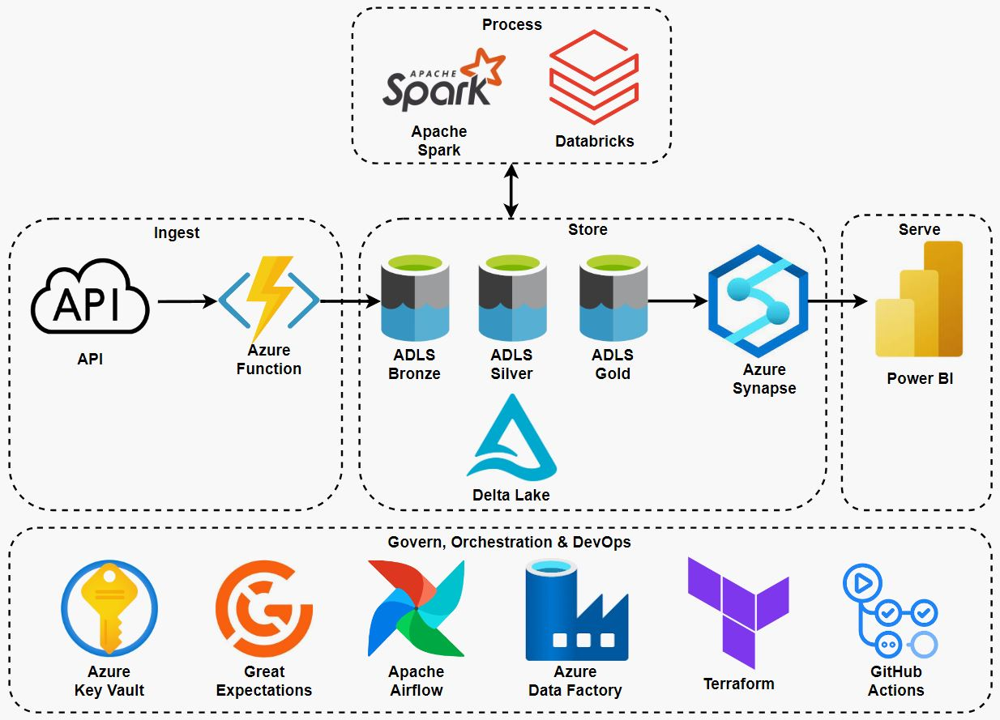

# Airbnb Host Analytics
This project aims to study the effect of Airbnb host characteristics on the performance of property listings measured in occupancy rates in the next 30 days. To achieve this, a reliable and robust end-to-end data solution has been designed and implemented.

## Architecture

- <b>Azure Function</b>:
- <b>Azure Data Lake Storage & Delta Lake</b>:
- <b>Apache Spark & Databricks</b>:
- <b>Azure Synapse</b>:
- <b>Power BI</b>:
- <b>Azure Key Valut</b>:
- <b>Great Expectations</b>:
- <b>Apache Airflow & Azure Data Factory</b>:
- <b>GitHub Actions</b>:

## Data Pipeline

## Data Modelling

## Data Quality

## DevOps
### CI

### CD

### IaC

## Insights

The dashboard showcases the influence of host characteristics on Airbnb listing occupancy rates. Key insights include:

- Super Host Status: Super Hosts tend to have higher occupancy rates, indicating that Airbnb's recognition of excellent service positively impacts bookings.

- Profile Photo: Hosts with profile photos see better occupancy rates, suggesting that photos may build trust with potential guests.

- Host About Description: Detailed and longer descriptions correlate with higher occupancy rates, implying that guests value thorough information about their hosts.

- Years of Experience: More experienced hosts enjoy higher occupancy rates, likely due to better hosting practices and established trust.

- Review Count: Listings with a higher count of reviews generally have greater occupancy rates, underscoring the importance of guest feedback.

- Winning Attributes & Rest: Hosts with "winning" attributes (those linked to higher occupancy rates) significantly outperform those without, highlighting the benefits of cultivating positive hosting traits.

Overall, the data suggests that personal touches and credibility markers like Super Host status, a clear profile photo, a rich host description, experience, and a high review count are key to enhancing an Airbnb listing's performance.

## Data Source
This study is conducted over the Airbnb listing datasets provided by [Inside Airbnb](http://insideairbnb.com/).