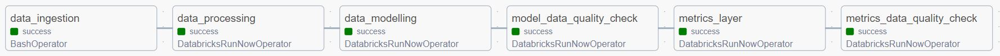

# Airbnb Host Analytics
This project aims to study the effect of Airbnb host characteristics on the performance of property listings measured in occupancy rates in the next 30 days. To achieve this, a reliable and robust end-to-end data solution has been designed and implemented.

## Scope
The scope of this project covers the Melbourne Airbnb listing data from March 2023 to June 2023.
In processing the data, the following conditions are applied:
- Host identity must be verified for valid hosts.
- Room availability for next 60, 90 and 365 days must not be zero to ensure only available listings are considered.
- Municipality of the listing must be metropolitan municipalities to eliminate rural area effect.
- Listing must be an entire home/apt to limit diversity of the listing type.
- Price must be within the range between median and upper limit (median + 1.5 Inter Quantile Range) to filter out outliers and reduce price factor.

The data is to be processed and consumed as an once-off study, while served in a metrics layer for the seamless BI integration.

## Architecture

The architecture of the end-to-end data solution comprises of a mix of open source and cloud tools hosted on Azure cloud environment. The data originates from the API server undergoing ingestion, storage, processing and lastly serving for analytics. Below describes how each tool participates in this data landscape.

- <b>Azure Functions</b>:  
Azure function app fetches Airbnb listing data from the API server and loads raw datasets as Parquet files into the Bronze layer of data lakehouse hosted on the Azure Data Lake Storage Gen 2.
- <b>Azure Data Lake Storage (ADLS) & Delta Lake</b>:  
Azure Data Lake Storage and Delta Lake support the data lakehouse enabling affordable, scalable storage with ACID transactions.
- <b>Apache Spark & Databricks</b>:  
Apache Spark is the main data processing engine running on the Databricks cluster. It interacts with the datasets sitting in the data lakehouse to progressively develope datasets through Bronze, Silver, Gold layers of the medallion architecture.
- <b>Azure Synapse</b>:  
The Gold layer dataset is copied into Azure Synapse from the data lakehouse. Azure Synapse is a datawarehouse servicing analytics and providing connections to the business intelligence tools.  
Note that Databricks also provides analytics features with its SQL warehouse and Dashboards. However due to limited resources of the Azure free-tier account, Azure Synapse was implemented instead for the analytics workload.
- <b>Power BI</b>:  
Power BI serves to provide data visualisations using the metrics layer dataset.
- <b>Azure Key Vault</b>:  
Azure Key Vault is used to store credentials of the Azure storage account, allowing data processes to access datasets in the data lakehouse securely.
- <b>Great Expectations</b>:  
Great Expectations is used as a data qaulity framework ensuring resultant data assets to be validated and reliable in the Gold layer of the data lakehouse.
- <b>Apache Airflow & Azure Data Factory</b>:   
Apache Airflow orchestrates the data flow by triggering Azure function app and Spark jobs on Databricks. Airflow is hosted on Azure Data Factory as a managed service.
- <b>Terraform</b>:  
Terraform is used to manage Azure Data Lake Storage infrastructure.
- <b>GitHub Actions</b>:  
GitHub Actions hosts CI pipeline running unit tests and integration tests on the data processes.

## Data Pipeline

The data pipeline is consisted of the following 6 tasks.

- <b>data_ingestion</b>:  
This task triggers the Azure function app by making a HTTP request. The triggered function will then fetches Airbnb listing datasets and load as Parquet files into the Bronze layer of the data lakehouse.
- <b>data_processing</b>:  
A Spark job in Databricks is triggered to process and filter the raw datasets with the conditions listed in the [Scope](#Scope). The processed datasets are then loaded into the Silver layer as Delta Lake tables.
- <b>data_modelling</b>:  
This task executes a Spark job in Databricks to transform the processed datasets into dimensional model tables. The dimensional model is stored in the Gold-dev layer.
- <b>model_data_quality_check</b>:  
A Python job in Databricks is initiated to validate dimensional model's data quality in the Gold-dev layer. The datasets are validated against the test cases defined in the YAML files using Great Expectations. Once validated successfully, the datasets are loaded into the Gold layer for consumption.
- <b>metrics_layer</b>:  
This task triggers a Spark job in Databricks to build a metrics layer on top of the dimensional model. The metrics layer table is then loaded into the Gold-dev layer.
- <b>metrics_data_quality_check</b>:  
This task validates the metrics layer in the Gold-dev layer using a Python job in Databricks. Great Expectations is used to check the data quality using test cases defined in the YAML file. After a successful data quality check, the metrics layer dataset is loaded into the Gold layer for consumption.

In scheduling the above tasks in Airflow, job monitoring is aided with email alerts via SMTP by sending email alerts upon a success or failure of the job.

## Data Modelling
<add medallion architecture>
bronze -> silver -> gold (& gold-dev) layers
<add data modelling image>
- SCD type 2
- Monthly snapshot fact table
- metrics layer with the latest data

## Data Quality
write, audit, publish for gold layer data assets

## DevOps
### CI

### CD

### IaC

## Considerations
- <b>Data Lifecycle</b>:  
https://learn.microsoft.com/en-us/azure/databricks/optimizations/archive-delta
- <b>Query Optimisation</b>:  
- <b>End-to-End testing</b>:  
end-to-end testing using non-production environment before executing jobs in the production

## Insights

The dashboard showcases the influence of host characteristics on Airbnb listing occupancy rates. Key insights include:

- <b>Super Host Status</b>:  
Super Hosts tend to have higher occupancy rates, indicating that Airbnb's recognition of excellent service positively impacts bookings.

- <b>Profile Photo</b>:  
Hosts with profile photos see better occupancy rates, suggesting that photos may build trust with potential guests.

- <b>Host About Description</b>:  
Detailed and longer descriptions correlate with higher occupancy rates, implying that guests value thorough information about their hosts.

- <b>Years of Experience</b>:  
More experienced hosts enjoy higher occupancy rates, likely due to better hosting practices and established trust.

- <b>Review Count</b>:  
Listings with a higher count of reviews generally have greater occupancy rates, underscoring the importance of guest feedback.

- <b>Winning Attributes & Rest</b>:  
Hosts with "winning" attributes (those linked to higher occupancy rates) significantly outperform those without, highlighting the benefits of cultivating positive hosting traits.

Overall, the data suggests that personal touches and credibility markers like Super Host status, a clear profile photo, a rich host description, experience, and a high review count are key to enhancing an Airbnb listing's performance.

## Data Source
This study is conducted over the Airbnb listing datasets provided by [Inside Airbnb](http://insideairbnb.com/).